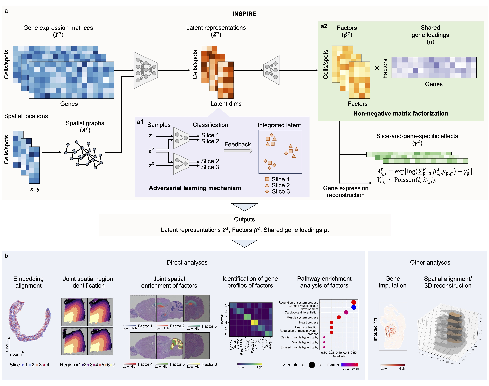

# INSPIRE
[](https://doi.org/10.5281/zenodo.18330972)

*INSPIRE: interpretable, flexible and spatially-aware integration of multiple spatial transcriptomics datasets from diverse sources*

An effective and efficient method for joint analyses of multiple spatial transcriptomics datasets.



We develop INSPIRE, a deep learning-based method for integrating and interpreting multiple spatial transcriptomics (ST) datasets from diverse sources. It integrates information across sections in a shared latent space, where meaningful biological variations from the input sections are preserved, while complex unwanted variations are eliminated. Utilizing this shared latent space, INSPIRE achieves an integrated NMF on gene expressions across sections, decomposing biological signals in different sections into consistent and interpretable spatial factors with associated gene programs. These inferred spatial factors often correspond to distinct cell populations and biological processes within the analyzed tissues.

INSPIRE takes gene expression count matrices and spatial coordinates from multiple ST sections as input, and generates three key outputs: latent representations of cells or spatial spots, non-negative spatial factors for cells or spatial spots, and non-negative gene loadings shared among datasets.

By integrating multiple ST datasets with INSPIRE, users can:
* Identify spatial trajectories and major spatial regions consistently across datasets using latent representations of cells or spatial spots.
* Reveal detailed tissue architectures, spatial distributions of cell types, and organizations of biological processes in tissues across sections using non-negative spatial factors of cells or spatial spots.
* Detect spatially variable genes, identify gene programs associated with specific spatial architectures in tissues, and conduct pathway enrichment analysis using non-negative gene loadings.

## Installation
* INSPIRE can be downloaded from GitHub:
```bash
git clone https://github.com/jiazhao97/INSPIRE.git
cd INSPIRE
conda env update --f environment.yml
conda activate INSPIRE
```

## Quick start and usage instructions
Starting with raw gene expression count matrices and spatial coordinate matrics obtained from multiple tissue sections, each formatted as an individual AnnData object, INSPIRE provides two integration options: one based on graph attention networks (GATs) and the other on lightweight graph convolutional networks (LGCNs). For tissue sections profiled using low-resolution platforms such as Visium or ST, we recommend employing the graph attention network variant of INSPIRE to leverage the attention mechanism for improved modeling accuracy. In contrast, for high-resolution datasets, the lightweight graph convolutional network variant is recommended, as it provides enhanced computational efficiency and scalability for large-scale analyses.

We provide instructions for users to get a quick start, including annotated demos and example data: [Using INSPIRE with graph attention networks (GATs)](https://inspire-tutorial.readthedocs.io/en/latest/examples/INSPIRE_GAT.html), [Using INSPIRE with lightweight graph convolutional networks (LGCNs)](https://inspire-tutorial.readthedocs.io/en/latest/examples/INSPIRE_LGCN.html).


## Tutorials and reproducibility

In our manuscript, we demonstrate that INSPIRE is applicable to a range of biologically significant integrative analysis scenarios:
* Integration of multiple ST sections from biological replicate samples, leveraging information across sections to enhance the accuracy of downstream analysis.
* Integration of multiple ST sections offering complementary views of complex tissue, where spatial structures only partially overlap, to construct a comprehensive spatial atlas.
* Integration of multiple ST sections from distinct ST technologies, harnessing the unique strengths of each to deepen biological insights.
* Integration of ST sections under different biological conditions, depicting meaningful biological signals unique to certain conditions.
* Integration of high-resolution human cancer sections, revealing microenvironment heterogeneity across distinct tumor subtypes.
* Integration of multiple whole-embryo ST sections collected across various developmental stages to unravel complex dynamic changes during embryonic development.
* Integration of multiple adjacent ST sections along an axis to reconstruct 3D structures of organs or entire organisms, offering deeper insights beyond traditional 2D analyses.

We provide tutorials and codes for reproducing the experiments of our paper at [this tutorial website](https://inspire-tutorial.readthedocs.io/en/latest/index.html#).

## Reference

Jia Zhao, Xiangyu Zhang, Gefei Wang, Yingxin Lin, Tianyu Liu, Rui B. Chang, Hongyu Zhao. INSPIRE: interpretable, flexible and spatially-aware integration of multiple spatial transcriptomics datasets from diverse sources. Preprint. 2024. [https://doi.org/10.1101/2024.09.23.614539](https://doi.org/10.1101/2024.09.23.614539).
